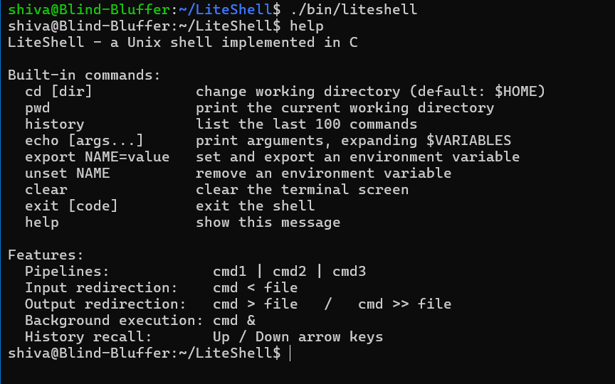
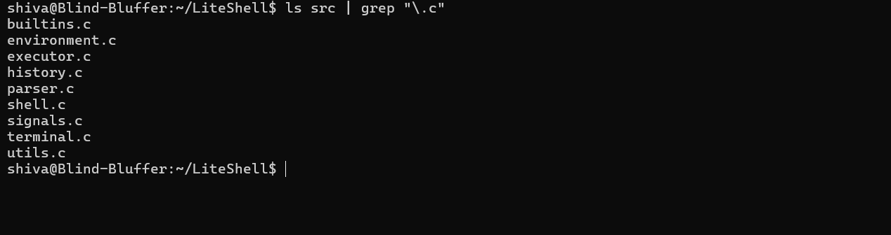
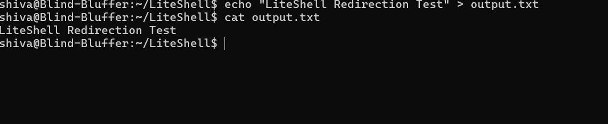
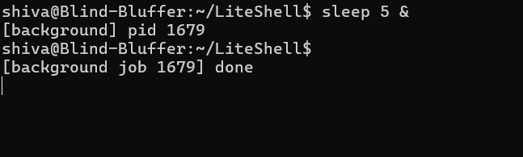
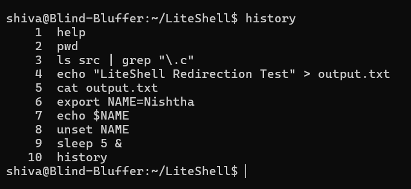

# LiteShell

A Unix/Linux shell written from scratch in **C** that demonstrates core Operating Systems concepts including process management, pipes, file descriptors, signal handling, environment management, and raw terminal programming.

```bash
shiva@Blind-Bluffer:~/LiteShell$ ls | grep .c | wc -l
9
shiva@Blind-Bluffer:~/LiteShell$
```

---

## Table of Contents

* [Overview](#overview)
* [Features](#features)
* [Architecture](#architecture)
* [Execution Flow](#execution-flow)
* [Folder Structure](#folder-structure)
* [System Calls Used](#system-calls-used)
* [Build Instructions](#build-instructions)
* [Usage](#usage)
* [Example Commands](#example-commands)
* [Screenshots](#screenshots)
* [Known Limitations](#known-limitations)
* [Learning Outcomes](#learning-outcomes)
* [Future Improvements](#future-improvements)

---

## Overview

LiteShell is a POSIX-style command-line shell built from scratch in C. It supports command execution, pipelines, input/output redirection, background processes, environment variables, command history, and raw terminal input while following a modular design.

### Highlights

* Built entirely in C using POSIX APIs
* Supports external commands and built-in commands
* Multi-stage pipelines using `pipe()`
* Input (`<`) and output (`>`, `>>`) redirection
* Background execution using `&`
* Command history with persistent storage
* Raw terminal input with arrow-key history navigation
* Environment variable expansion (`$VAR`, `${VAR}`)
* Clean modular architecture (9 source modules)
* Builds with zero compiler warnings using `gcc -Wall -Wextra`

---

## Features

| Category            | Details                                                                        |   |
| ------------------- | ------------------------------------------------------------------------------ | - |
| **Execution**       | Executes external commands using `fork()`, `execvp()`, and `waitpid()`         |   |
| **Built-ins**       | `cd`, `pwd`, `history`, `help`, `clear`, `exit`, `echo`, `export`, `unset`     |   |
| **History**         | Stores the last 100 commands with persistent history in `~/.liteshell_history` |   |
| **Line Editing**    | Raw terminal input with Backspace and Up/Down arrow history recall             |   |
| **Pipelines**       | Supports multi-stage pipelines using `                                         | ` |
| **Redirection**     | Supports `<`, `>`, and `>>`                                                    |   |
| **Background Jobs** | Run commands in the background using `&`                                       |   |
| **Variables**       | `$VAR`, `${VAR}`, `export`, and `unset`                                        |   |
| **Signals**         | Handles `Ctrl+C` and `Ctrl+D` correctly                                        |   |
| **Parsing**         | Supports quotes, escapes, whitespace handling, and operators                   |   |
| **Prompt**          | Displays `username@hostname:directory$` with `~` for the home directory        |   |

---

## Architecture

LiteShell follows a modular pipeline similar to a traditional Unix shell.

```
┌────────────┐   ┌────────────┐   ┌────────────┐   ┌────────────┐
│  terminal  │──▶│   parser   │──▶│environment │──▶│  executor  │
│ raw input  │   │ tokenizing │   │ $VAR       │   │ fork/exec  │
└─────┬──────┘   └─────┬──────┘   └─────┬──────┘   └─────┬──────┘
      │                │                │                │
      ▼                ▼                ▼                ▼
  user input      parsed command    expanded args    running process
      │
      ▼
┌────────────┐
│  history   │
└────────────┘
```

Each module has a single responsibility, making the project easier to understand, maintain, and extend.

### Module Responsibilities

| Module          | Responsibility                                  |
| --------------- | ----------------------------------------------- |
| `shell.c`       | Main REPL loop and prompt                       |
| `terminal.c`    | Raw terminal mode and line editing              |
| `history.c`     | Command history and persistence                 |
| `parser.c`      | Tokenization and command parsing                |
| `environment.c` | Environment variable expansion                  |
| `executor.c`    | Process creation, pipes, redirection, execution |
| `builtins.c`    | Built-in command implementations                |
| `signals.c`     | Signal handling                                 |
| `utils.c`       | Utility functions and error handling            |

---

## Execution Flow

1. Display the shell prompt.
2. Read user input in raw terminal mode.
3. Store the command in history.
4. Parse tokens, quotes, pipes, and redirection.
5. Expand environment variables.
6. Execute built-in or external commands.
7. Wait for foreground processes or immediately return for background jobs.

---

## Folder Structure

```text
LiteShell/
├── include/
├── src/
├── screenshots/
├── build/
├── bin/
├── Makefile
└── README.md
```

---

## System Calls Used

| System Call                            | Purpose                         |
| -------------------------------------- | ------------------------------- |
| `fork()`                               | Create child processes          |
| `execvp()`                             | Execute external commands       |
| `waitpid()`                            | Wait for child processes        |
| `pipe()`                               | Create pipelines                |
| `dup2()`                               | Redirect standard input/output  |
| `open()` / `close()`                   | File redirection                |
| `chdir()`                              | Change working directory        |
| `getcwd()`                             | Print current directory         |
| `sigaction()`                          | Install signal handlers         |
| `tcgetattr()` / `tcsetattr()`          | Raw terminal mode               |
| `read()`                               | Read keyboard input             |
| `getenv()` / `setenv()` / `unsetenv()` | Environment variable management |

---

## Build Instructions

### Requirements

* Linux or Unix environment
* GCC (tested with GCC 13.3.0)
* GNU Make

### Build

```bash
git clone https://github.com/nishtha322/LiteShell.git
cd LiteShell
make
```

### Run

```bash
make run
```

or

```bash
./bin/liteshell
```

### Clean

```bash
make clean
```

The project is compiled using:

```bash
gcc -std=c11 -Wall -Wextra -D_POSIX_C_SOURCE=200809L -D_DEFAULT_SOURCE -Iinclude
```

The POSIX feature macros enable APIs such as `setenv()`, `unsetenv()`, `gethostname()`, and `termios`. The project builds with **zero compiler warnings**.

---

## Usage

Launch LiteShell:

```bash
./bin/liteshell
```

Example prompt:

```text
john@ubuntu:~/Projects$
```

* Press **Enter** to execute commands.
* Press **Ctrl+C** to interrupt the foreground process.
* Press **Ctrl+D** to exit the shell.
* Use **Up/Down Arrow** to browse command history.

---

## Example Commands

### Built-ins

```bash
pwd
cd /tmp
cd
history
help
clear
export NAME=John
echo $NAME
unset NAME
```

### Pipelines

```bash
ls | grep txt
cat file.txt | sort | uniq
ps aux | grep bash | wc -l
```

### Redirection

```bash
sort < input.txt
ls > output.txt
ls >> output.txt
```

### Combined

```bash
cat file.txt | grep hello > result.txt
sort < input.txt | uniq > output.txt
```

### Background Execution

```bash
sleep 5 &
```

### Quoting

```bash
echo "Hello World"
mkdir "My Folder"
echo "A B C"
```

---

## Screenshots

### Startup



### Pipes



### Redirection



### Background Jobs



### History



---

## Known Limitations

* Line editing supports Backspace and history navigation but not left/right cursor movement.
* No job control commands such as `jobs`, `fg`, or `bg`.
* No filename globbing (`*.txt`) or command substitution (`$(...)`).
* Quote handling is simplified compared to a full POSIX shell.
* Shell scripting is not currently supported.

---

## Learning Outcomes

Building LiteShell strengthened my understanding of:

* Process creation with `fork()` and `execvp()`
* Process synchronization using `waitpid()`
* Pipes and file descriptor management with `pipe()` and `dup2()`
* Signal handling using `sigaction()`
* Raw terminal programming using `termios`
* Environment variable management
* Modular software design in C
* POSIX system programming

---

## Future Improvements

* Left/right arrow cursor movement
* Home/End key support
* Tab completion
* `jobs`, `fg`, and `bg`
* Command substitution (`$(...)`)
* Filename globbing (`*.txt`)
* Shell scripting support
* Unit tests for parser and executor modules
* Improved POSIX-compatible parsing

---


